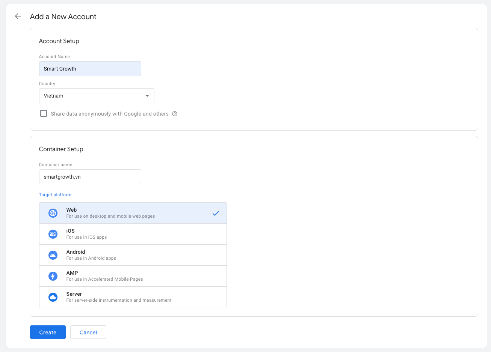

## Google Tag Manager

Truy cập website Google Tag Manager sau khi đã đăng nhập tài khoản Google để thiết lập. 

- Tạo tài khoản theo dõi mới [tại đây](https://tagmanager.google.com/#/admin/accounts/create)
- Nhập thông tin cơ bản mô tả website

- Chấp nhận điều khoản và chọn Yes (góc phải)

- Copy đoạn mã theo dõi


## Cài plugin Google Tag Manager

Chạy lệnh trong terminal

```
npm install --save @docusaurus/plugin-google-tag-manager
```

## Thiết lập cấu hình docusaurus.config.js

```js docusaurus.config.js
presets: [

[

'classic',

/** @type {import('@docusaurus/preset-classic').Options} */

({

// highlight-start
googleTagManager: {

containerId: 'GTM-PSDJMMPL',

},
// highlight-end
```

## Google Analytics


Điền tên domain vào phần Account details và bấm Next ở cuối trang để tiếp tục


Copy đoạn mã theo dõi Google Analytics


Quay lại Google Tag Manager để thiết lập


Hoàn thành, dữ liệu sẽ cập nhật trong 48h (khi có người truy cập)

